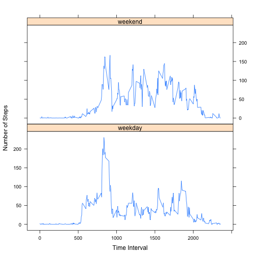

by Bhaskar Parvathaneni

## Loading and preprocessing the data
Load the input activity data from a zip file in the current R working directory. The assumption here is that the current working directory contains the data file. The input data file is unzipped and the data read using read.csv. The data in the date field is properly reformated.


```r
activityDataFileName <- unzip("activity.zip")
activityData <- read.csv(activityDataFileName, stringsAsFactors=FALSE)
activityData$date <- as.Date(activityData$date)
```

The number of missing values in the activity data is as follows

```r
sum(is.na(activityData))
```

```
## [1] 2304
```


##  What is mean total number of steps taken per day?
In order to analyze the activity data for this part of the assignment the following steps must be completed
* Create a new data set by removing the missing elements from the original data set
* Compute a new data set with sum total steps per day using the aggregate function

```r
activityDataWithNoNAs <- activityData[complete.cases(activityData$steps),]
totalActivityStepsDataWithNoNAs <- aggregate(steps ~ date, FUN=sum, data=activityDataWithNoNAs)
```

### Histogram for total number of steps per day
Plot the histogram for the total number of steps taken each day

```r
hist(totalActivityStepsDataWithNoNAs$steps, breaks=10, xlab="Total Steps", ylab="days", main="Total Steps Taken Per Day")
```

 

### Mean and Median for Daily Activity
The mean and median for the total number of steps per day excluding missing values is as follows:

```r
mean(totalActivityStepsDataWithNoNAs$steps)
```

```
## [1] 10766
```

```r
median(totalActivityStepsDataWithNoNAs$steps)
```

```
## [1] 10765
```


## What is the average daily activity pattern?
The daily activity pattern is obtained by aggregating the data in 5 minute intervals during the 24 hour period. This aggregated data will be used to generate the time series plot.

```r
activityIntervalDataWithNoNAs <- aggregate(steps ~ interval, data=activityDataWithNoNAs, FUN=mean)
```

### Five Minute Interval Time-Series Plot
The Time-series plot of the 5-min interval with average number of steps take and the code to generate it are shown here

```r
plot(activityIntervalDataWithNoNAs, type="l", main="Activity Pattern in 5-Min Intervals", xlab="5-Min Intervals", ylab="Number of Steps")
```

 

### Interval With Max Steps
Shown here is the code and the value for the 5 min interval that contains the maximum number of steps. The code and generated result values for the interval and max steps are as follows.

```r
activityIntervalDataWithNoNAs$interval[which.max(activityIntervalDataWithNoNAs$steps)]
```

```
## [1] 835
```

```r
activityIntervalDataWithNoNAs$steps[which.max(activityIntervalDataWithNoNAs$steps)]
```

```
## [1] 206.2
```


## Inputing missing values
The raw activity data set provided for this project had a number of missing values as shown here

```r
sum(is.na(activityData))
```

```
## [1] 2304
```

The goal here is to fill the missing values in the data set to eliminate any bias and redo the analysis.

### Strategy for inputting Missing data
The strategy followed here is to replace the missing values with the average for the 5-minute interval as is done in the following code snippet

```r
fullActivityData <- activityData
for (row in 1:nrow(activityData)) {
    if (is.na(activityData$steps[row])) {
        intPeriod <- fullActivityData$interval[row]
        fullActivityData$steps[row] <- activityIntervalDataWithNoNAs$steps[activityIntervalDataWithNoNAs$interval==intPeriod]
    }
}
```

Number of missing records in full data set after adding missing values is

```r
sum(is.na(fullActivityData))
```

```
## [1] 0
```

### Histogram for Number of Steps Taken
Compute the sum total steps per day using the full data set with filled in missing values

```r
totalActivityStepsFullData <- aggregate(steps ~ date, FUN=sum, data= fullActivityData)
```

Plot the histogram for the total number of steps taken each day with full data set

```r
hist(totalActivityStepsFullData$steps, breaks=10, xlab="Total Steps", ylab="days", main="Total steps taken per day, full data set")
```

 

### Mean and Median
The mean and median for the total number of steps per day with the full data set is as follows:

```r
mean(totalActivityStepsFullData$steps)
```

```
## [1] 10766
```

```r
median(totalActivityStepsFullData$steps)
```

```
## [1] 10766
```

The observation is that the missing values had very little impact on computing the mean and median for the total number of steps per day. The only change is a small increment in the median value as seen above.


## Are there differences in activity patterns between weekdays and weekends?
In this part of the assignment the data in the full data set is partitioned using the date field to classify it as weekday or weekend using the weekdays method().


```r
weekDayType <- function(dateValue) {
    if (weekdays(dateValue) %in% c("Saturday", "Sunday")) {
        "weekend"
    }
    else {
        "weekday"
    }
}

fullActivityData$dayType <- as.factor(sapply(fullActivityData$date, weekDayType))
```

### Comparision Time-Series Panel Plot for Weekend vs Weekday
Now create a time-series panel plot

```r
require("latticeExtra")
```

```
## Loading required package: latticeExtra
## Loading required package: RColorBrewer
## Loading required package: lattice
```

```r
activityByDay <- aggregate(steps~interval+dayType, data=fullActivityData, mean)
names(activityByDay) <- c("interval", "dayType", "steps")

xyplot(steps ~ interval | dayType, activityByDay, type="l", layout=c(1,2), xlab="Time Interval", ylab="Number of Steps")
```

 

